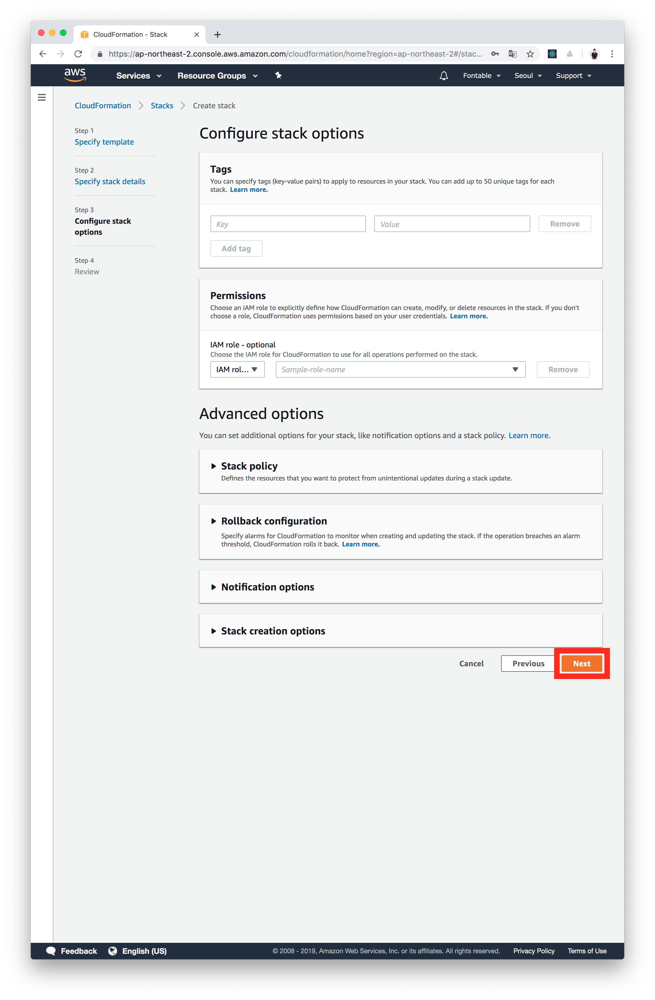
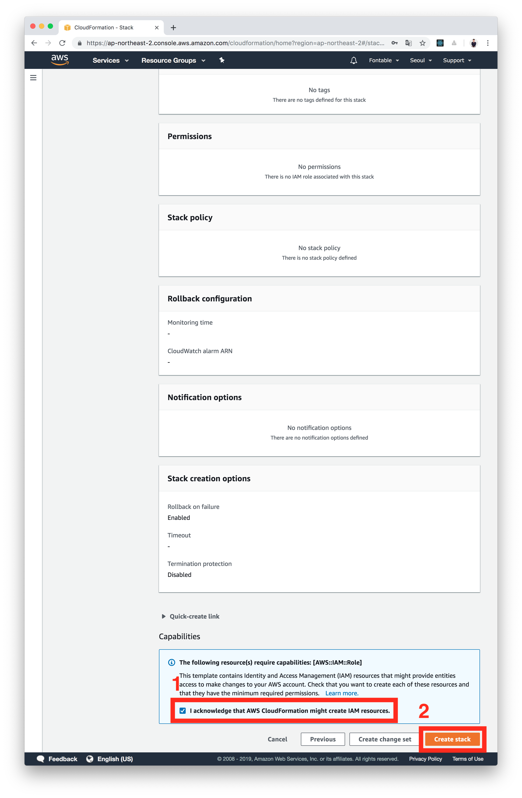

# Prisma CloudFormation Templates 🚀

## Architecture 📐


## Pre-requisites
- 🔑 **IAM Account** for *AWS CLI* (Requires pre-configuration using `aws configure`)
  ```bash
  $ aws configure
  ```
- Create service linked role
  ```bash
  $ aws iam create-service-linked-role --aws-service-name ecs.amazonaws.com
  ```

## Download CloudFormation Templates 📄
- `prisma.mysql.yml`
  - MySQL Template
  - [Download](https://raw.githubusercontent.com/tonyfromundefined/prisma-cloudformation/master/prisma.mysql.yml)
- `prisma.aurora.serverless.yml`
  - Aurora Serverless Template
  - [Download](https://raw.githubusercontent.com/tonyfromundefined/prisma-cloudformation/master/prisma.aurora.serverless.ymll)

## How to deploy
- Download the template file for your desired DB below
- Go to [AWS CloudFormation Console](https://ap-northeast-2.console.aws.amazon.com/cloudformation)
- Click `Create Stack`

- Check `Upload a template file`
- Click `Choose File` and choose template file (`.yml`)
- Click `Next`

- Enter `Stack Name`
- Modify specific details
- Click `Next`

- Click `Next`


- Check `I acknowledge that AWS CloudFormation might create IAM resources.`
- Click `Create Stack`

- When the deployment ended, you can find an endpoint of prisma in `Outputs` section.

## Todos
- [ ] PostgreSQL Template
- [ ] MongoDB(DocumentDB) Template

## References
> - https://www.prisma.io/tutorials/deploy-prisma-to-aws-fargate-ct14
> - https://github.com/prisma/database-templates/blob/master/aws/mysql.yml
> - https://github.com/prisma/prisma-templates/blob/master/aws/fargate.yml
> - https://docs.aws.amazon.com/AWSCloudFormation/latest/UserGuide/Welcome.html